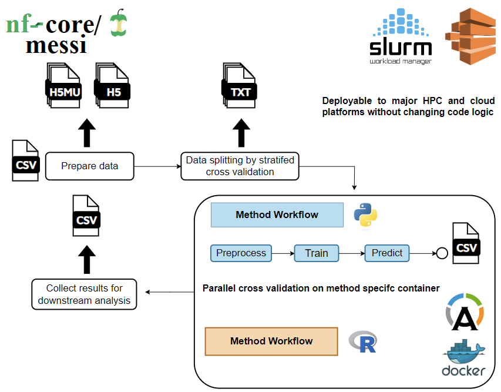
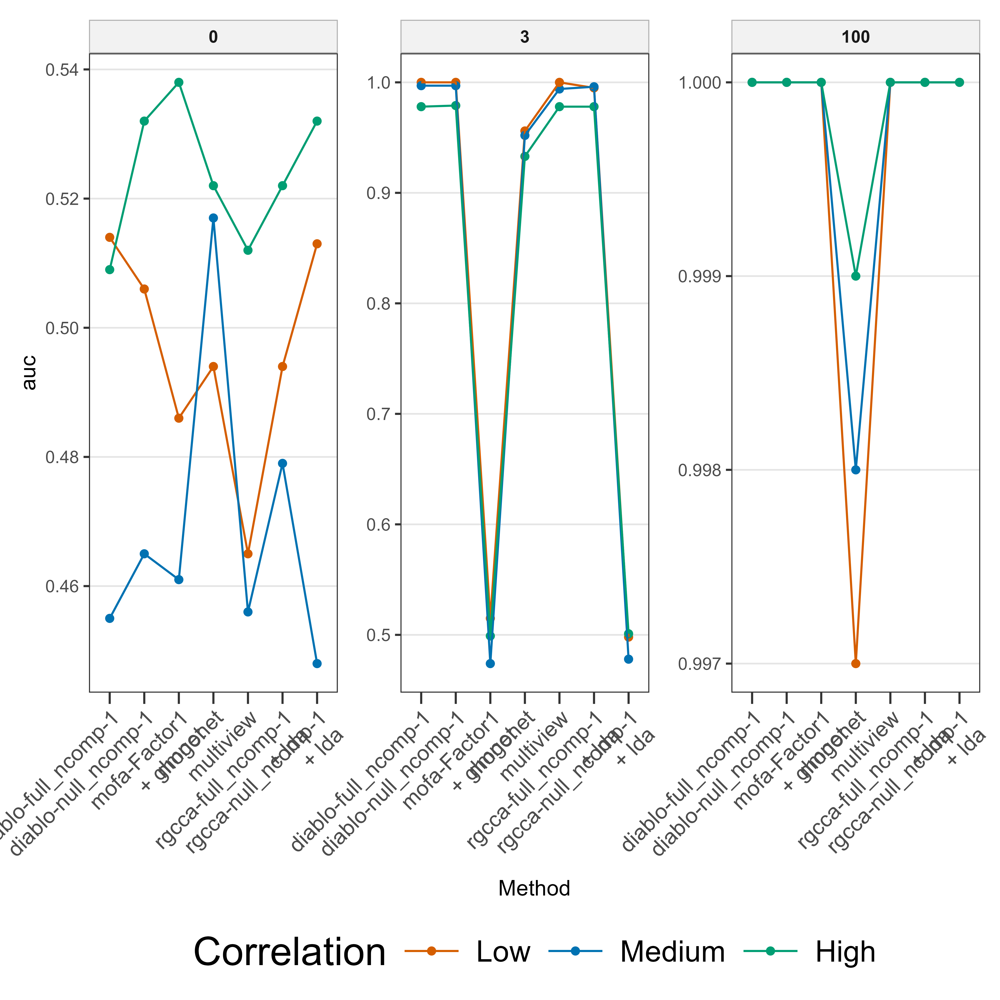
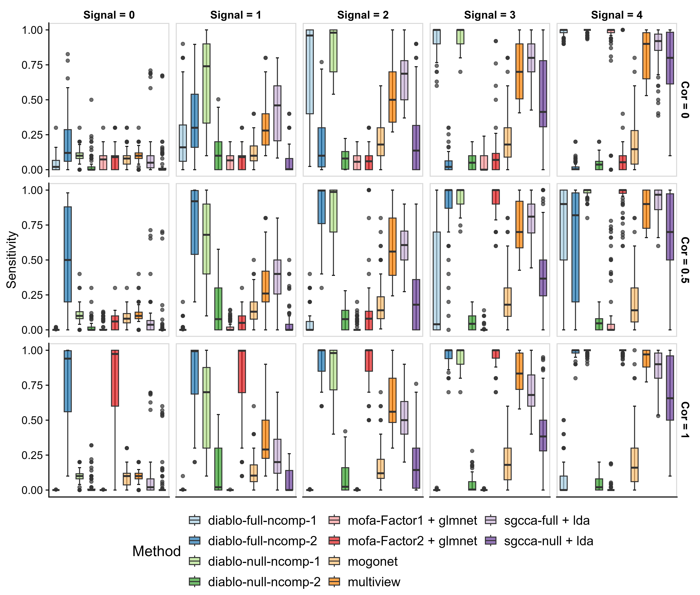
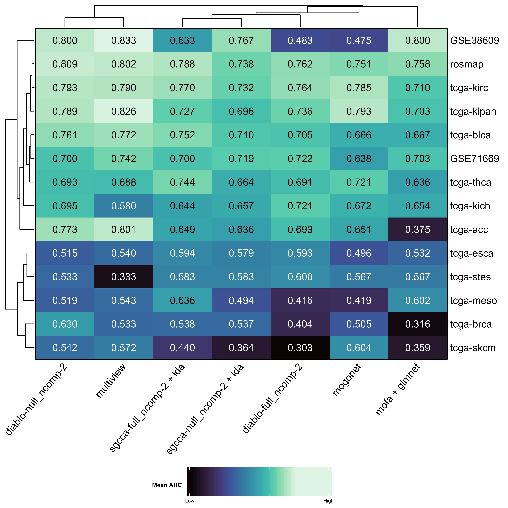
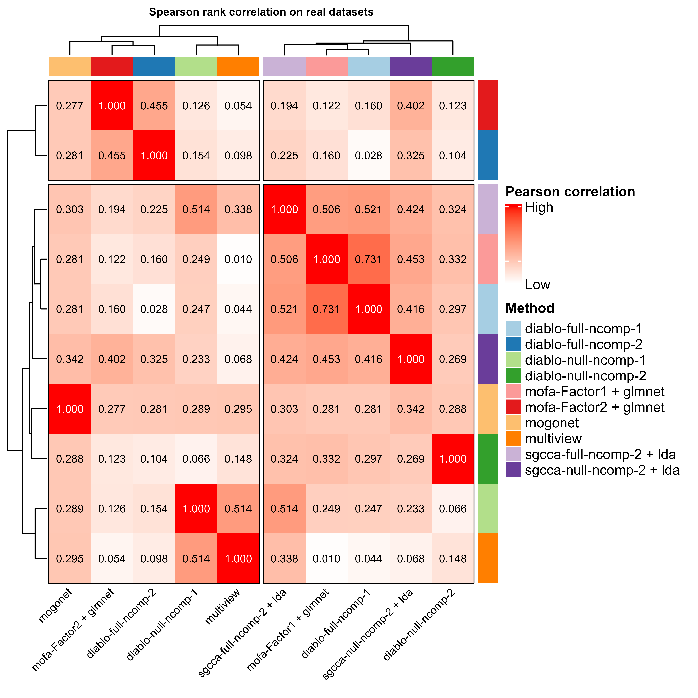

# Abstract

Technological advances enable multiomics profiling of molecular data (e.g., genes, proteins, metabolites) from biological samples at bulk, single-cell, spatial resolution. Integrative methods identify shared patterns and biomarkers, improving disease understanding and clinical strategies. However, method selection is challenging due to varying analytical tasks (e.g., clustering, prediction) and data types. Existing reviews are task-specific or non-reproducible. We propose an automated framework in Nextflow, *MESSI*, for systematic benchmarking of multiomics methods. It ensures reproducibility, standardizes inputs across tasks, and runs on any computing platform, enabling reliable method evaluation and selection.

**Keywords**: bioinformatics pipeline, multiomics integration methods, machine learning, benchmark, multimodal learning


# Background

Technological advances have allowed for the profiling of different molecular measurements (e.g., genes, proteins, metabolites) from the same biological samples; termed multiomics [@hasin2017multi; @subramanian2020multi].

The majority of multiomics data are obtained for samples from individual patients (bulk multiomics data) and more recently with single-cell and spatial resolution.

Many methods have been developed to jointly analyze multiomics data to identify common patterns between datasets, and to identify biomarkers of disease [@vandereyken2023methods].

This integrative approach of multiomics data may strengthen the understanding of the molecular dynamics underlying the biological processes of diseases and may lead to novel strategies for early detection, prevention, and treatment of human diseases [@sun2016integrative].

Researchers face difficulties in choosing the right method due to the varying nature of analytical tasks such as clustering analysis, factor analysis, or cancer type prediction.

Hence, numerous reviews have benchmarked various integrative methods [@bersanelli2016methods; @cantini2021benchmarking; @hasin2017multi; @huang2017more; @li2018review; @li2022benchmark; @luecken2022benchmarking; @pucher2019comparison; @richardson2016statistical; @yu2018integrative; @zeng2018review]. However, these studies often focus on methods for specific tasks or data types and may lack reproducibility.

To address this, we propose a new automated framework to systematically benchmark and analyze multiomics methods (table \@ref(tab:method-meta-table)) with varying data types. This framework ensures full reproducibility and provides standardized input for any analytical task, with the capability to run on any computing platform.


<table class="table" style="color: black; width: auto !important; margin-left: auto; margin-right: auto;">
<caption>List of available multiomics integration methods</caption>
 <thead>
  <tr>
   <th style="text-align:left;"> Method </th>
   <th style="text-align:left;"> Type </th>
   <th style="text-align:left;"> Language </th>
   <th style="text-align:left;"> Package available </th>
   <th style="text-align:left;"> Paper link </th>
   <th style="text-align:left;"> Code link </th>
  </tr>
 </thead>
<tbody>
  <tr>
   <td style="text-align:left;"> DIABLO </td>
   <td style="text-align:left;"> GCCA </td>
   <td style="text-align:left;"> R </td>
   <td style="text-align:left;"> yes </td>
   <td style="text-align:left;"> https://academic.oup.com/bioinformatics/article/35/17/3055/5292387 </td>
   <td style="text-align:left;"> https://mixomicsteam.github.io/mixOmics-Vignette/id_06.html </td>
  </tr>
  <tr>
   <td style="text-align:left;"> MOFA+ </td>
   <td style="text-align:left;"> Factor analysis </td>
   <td style="text-align:left;"> R/Python </td>
   <td style="text-align:left;"> yes </td>
   <td style="text-align:left;"> https://genomebiology.biomedcentral.com/articles/10.1186/s13059-020-02015-1 </td>
   <td style="text-align:left;"> https://github.com/bioFAM/mofapy2/blob/master/mofapy2/notebooks/getting_started_python.ipynb </td>
  </tr>
  <tr>
   <td style="text-align:left;"> RGCCA </td>
   <td style="text-align:left;"> GCCA </td>
   <td style="text-align:left;"> R </td>
   <td style="text-align:left;"> yes </td>
   <td style="text-align:left;"> https://link.springer.com/article/10.1007/s11336-017-9573-x </td>
   <td style="text-align:left;"> https://github.com/rgcca-factory/RGCCA </td>
  </tr>
  <tr>
   <td style="text-align:left;"> IntegrAO </td>
   <td style="text-align:left;"> IntegrAo </td>
   <td style="text-align:left;"> Python </td>
   <td style="text-align:left;"> yes </td>
   <td style="text-align:left;"> https://www.nature.com/articles/s42256-024-00942-3 </td>
   <td style="text-align:left;"> https://github.com/bowang-lab/IntegrAO/blob/main/tutorials/simulated_cancer_omics.ipynb </td>
  </tr>
  <tr>
   <td style="text-align:left;"> IntegratedLearner </td>
   <td style="text-align:left;"> IntegratedLearner </td>
   <td style="text-align:left;"> R </td>
   <td style="text-align:left;"> yes </td>
   <td style="text-align:left;"> https://onlinelibrary.wiley.com/doi/full/10.1002/sim.9953?saml_referrer </td>
   <td style="text-align:left;"> https://github.com/himelmallick/IntegratedLearner </td>
  </tr>
  <tr>
   <td style="text-align:left;"> Stabl </td>
   <td style="text-align:left;"> Stabl </td>
   <td style="text-align:left;"> Python </td>
   <td style="text-align:left;"> no </td>
   <td style="text-align:left;"> https://www.nature.com/articles/s41587-023-02033-x </td>
   <td style="text-align:left;"> https://github.com/gregbellan/Stabl/blob/stabl_lw/Notebook%20examples/Tutorial%20Notebook.ipynb </td>
  </tr>
  <tr>
   <td style="text-align:left;"> Cooperative Learning (multiview) </td>
   <td style="text-align:left;"> Penalized regression </td>
   <td style="text-align:left;"> R </td>
   <td style="text-align:left;"> yes </td>
   <td style="text-align:left;"> https://www.nature.com/articles/s41746-024-01128-2 </td>
   <td style="text-align:left;"> https://github.com/dingdaisy/cooperative-learning/ </td>
  </tr>
  <tr>
   <td style="text-align:left;"> MOGONET </td>
   <td style="text-align:left;"> GNN </td>
   <td style="text-align:left;"> Python </td>
   <td style="text-align:left;"> no </td>
   <td style="text-align:left;"> https://www.nature.com/articles/s41467-021-23774-w </td>
   <td style="text-align:left;"> https://github.com/txWang/MOGONET </td>
  </tr>
  <tr>
   <td style="text-align:left;"> GOAT </td>
   <td style="text-align:left;"> GNN </td>
   <td style="text-align:left;"> Python </td>
   <td style="text-align:left;"> no </td>
   <td style="text-align:left;"> https://academic.oup.com/bioinformatics/article/39/10/btad582/7280697 </td>
   <td style="text-align:left;"> https://github.com/DabinJeong/GOAT2.0 </td>
  </tr>
  <tr>
   <td style="text-align:left;"> mowgli </td>
   <td style="text-align:left;"> Matrix factorization, optimal transport </td>
   <td style="text-align:left;"> Python </td>
   <td style="text-align:left;"> yes </td>
   <td style="text-align:left;"> https://www.nature.com/articles/s41467-023-43019-2 </td>
   <td style="text-align:left;"> https://github.com/cantinilab/Mowgli </td>
  </tr>
  <tr>
   <td style="text-align:left;"> BEAM </td>
   <td style="text-align:left;"> BEAM </td>
   <td style="text-align:left;"> R </td>
   <td style="text-align:left;"> yes </td>
   <td style="text-align:left;"> https://www.biorxiv.org/content/10.1101/2024.07.31.605805v1 </td>
   <td style="text-align:left;"> https://annaseffernick.github.io/BEAMR/articles/BEAMR.html </td>
  </tr>
  <tr>
   <td style="text-align:left;"> SLIDE </td>
   <td style="text-align:left;"> SLIDE </td>
   <td style="text-align:left;"> R </td>
   <td style="text-align:left;"> yes </td>
   <td style="text-align:left;"> https://www.nature.com/articles/s41592-024-02175-z </td>
   <td style="text-align:left;"> https://github.com/jishnu-lab/SLIDE/blob/main/vignettes/SLIDE.pdf </td>
  </tr>
  <tr>
   <td style="text-align:left;"> JointNMF </td>
   <td style="text-align:left;"> JointNMF </td>
   <td style="text-align:left;"> JointNMF </td>
   <td style="text-align:left;"> JointNMF </td>
   <td style="text-align:left;"> JointNMF </td>
   <td style="text-align:left;"> https://cran.r-project.org/web/packages/nnTensor/vignettes/nnTensor-2.html </td>
  </tr>
  <tr>
   <td style="text-align:left;"> eipy </td>
   <td style="text-align:left;"> Ensemble </td>
   <td style="text-align:left;"> Python </td>
   <td style="text-align:left;"> yes </td>
   <td style="text-align:left;"> https://arxiv.org/abs/2401.09582 </td>
   <td style="text-align:left;"> https://github.com/GauravPandeyLab/eipy </td>
  </tr>
  <tr>
   <td style="text-align:left;"> multiVI </td>
   <td style="text-align:left;"> Deep Learning </td>
   <td style="text-align:left;"> Python </td>
   <td style="text-align:left;"> yes </td>
   <td style="text-align:left;"> https://www.nature.com/articles/s41592-023-01909-9 </td>
   <td style="text-align:left;"> https://docs.scvi-tools.org/en/stable/tutorials/notebooks/multimodal/MultiVI_tutorial.html </td>
  </tr>
</tbody>
</table>


# Results

## MESSI pipeline

We introduce here the MESSI pipeline, *Multiple Experiments with SyStematic Interrogation* (Fig \@ref(fig:messi-workflow-plot), and additional supplementary), which comprises of 4 main steps: 1) [Prepare data], 2) [Data splitting], 3) [Cross validation], 4) [Feature selection].

{width=60%}


MESSI is implemented with Nextflow [@di2017nextflow], a domain specific language (DSL) primarily used by bioinformaticians. Compared to traditional workflow management systems like Snakemake [@koster2012snakemake] or GNU make [@stallman1988gnu], Nextflow breaks down complex workflows into modular components, and connect them with channels which determines the flow of pipeline. This feature allows us to customize each module, extending the pipeline to not only benchmark purposes but also multi-purpose usage. Additionally, This modular design enables rapid, efficient and reproducible way to test and maintain codebases.

Moreover, the core feature of Nextflow of using containerization for modules like Docker [@docker2020docker] and Singularity [@kurtzer2017singularity] solves the reproducibility issue in replicating papers. 
Each time the pipeline is executed, containers are created for each process defined in the workflows that constitute the pipeline. These containers follow same sets of operating system configurations, software versions of the desired computation performed. Hence, it fulfills reproducibility and portability of our results as each time we run these independently on its own encapsulated environment. 
In addition, Nextflow creates unique working directory for each process spawned via these containers, and having all writing I/O operations in this specified directory without modifying the original input files. This way, we dont accidentally overwrite the raw data or any important input file without knowing in the first place.
Furthermore, the independence between each process leads nature of parallelizable computations. This characteristic of the pipeline along with the resumability of re-executing interrupted or failed processes make debugging or changing computational settings for certain methods only atomic and simple. 
Ultimately, it reduces time complexity of dealing with large datasets or long runtime computations, compared to standard way of sequentially executing complex scripts.
In terms of interoperability, Nextflow is capable to run the pipeline on various computing platforms including and not limited to our own personal computer, mainstream high-performance computing clusters (HPC) like SLURM, PBS or popular cloud platforms like AWS and Google cloud without modifying code logics. 
This is enabled from resource and parameters configurations, making user to only worry about configurations to carry out and not the code logic itself. 


With all these characteristics, benchmarking integration methods become trivial, as the data flow through different subworkflows and modules as if in factory, user should only be concerned on providing the right format of data and let MESSI handle the rest. Next, we will describe the main components of the pipeline as in and how each part is implemented as in Fig \@ref(fig:messi-workflow-plot).

### Prepare data


<!----

Things to comment:


- Explain its hard to compare method directly due to diffent input of method
- and their downstream output are not same, so need to standardize data and meethod
- These method are open source

- Mention how data expect to be in tar gz containing the MAE and MuData
- These data goes to a preprocess step of filtering
- And cleaning up "columns" or metadata of it
- Describe some parameters used here, that could be controlled through nextflow config
- So from here, we come to commonly used and cleaned mae and mudata for respective language method

--->


The first step of the pipeline is to prepare the datasets to be benchmarked against for each method thorough a series of common steps.  This is required as methods have different input format, hence we have to first standardize the raw data input, and pass them down to each method's own workflow to further processing.


The input of the pipeline is a csv like the following:

```csv
dataset_name,tar_path
rosmap,/path/to/data/rosmap.tar.gz
tcga-blca,/path/to/data/tcga-blca.tar.gz
```

These csv input allows user to specify multiples datasets as long it follows the requirement of providing an identifier, and a path to compressed tar which consists of two key file formats `.h5` and `.h5mu`. An example of a dataset compressed tar would be:

```bash
rosmap
|- mae_data
|   |- experiments.h5
|   |- mae.rds
|-- rosmap.h5mu
```

These format are used to handle MultiAssayExperiment (mae) [@ramos2017software] in R and MuData [@bredikhin2022muon] in Python. With these two core API, we could interchangeably transform the underlying multiomics data to the different language without losing content. This would also be a first try to unify standard file format used for multiomics data, as current studies usually have very distinct file formats, making it harder to reproduce in the future. In addition, We hope that using these two packages will help users adapt to other integration methods implemented in different languages they are familiar with.

Once having provided the input csv, our pipeline perform following steps to all input data:
1) uncompress each data record's tar file. 2) a) preprocess all mae portion of the data. b) preprare all mudata portion. 3) Parse the datasets using the mu portion only to retrieve common metadata from the datasets.

Step 1) is trivial as it uncompress data in specified working directory to not affect the original raw data. 
Step 2) is ran in a parallel fashion, where the two sub steps perform same preprocessing operations: removing NA observations, filtering features with lower variance than mean variance of each omics of a dataset, later removing those feature that still have near zero variance, i.e. most entries of a feature being same number (usually 0); lastly, coercing the response variable to binary entries if not already provided from the original raw data. 
We have make sure both python and R code are consistent enough, so when comparing datasets in different languages, the data underhood is still the identical at some numerical precision. 
Step 3) retrieves common metadata information like names of the omics present in every dataset, dimensions of its features, number of common observations, the positive class of the response and the proportion of it.

With these standardized data in MAE and MuData format, we then proceeds to next stages of the pipeline, with the MuData portion goes to a data splitting stage prior to model assessment part.

### Data Splitting 


<!---

Things to say

- This splitting is because not all methods carry a built in cv
- Moreover, this make sure all method start with same data setup, since cv in each method might vary due to random seed problem
- Stratified to make sure of handling class imbalance, possible to go into discussion

--->


To perform different types of analysis, we make sure to split data into folds as in usual cross validation way [insert citation here?] using the mudata part. This is because python libraries often have good support in dealing with these operations specifically libraries like scikit-learn [@kramer2016scikit] that provides well-tested API like stratifiedKFold. With this support we create the folds under a 5-fold setting and record the index of testing sets in each fold in txts for downstream usage. The number of folds can also be controlled via nextflow config option of `params.k`. 

THE FOLLOWING LINE DOESNT MAKE TOO MANY SENSE

This module of splitting data ensures we could always cross validate the data even when an integration method do not have this built-in functionality. In addition, we create these common data splits for all methods making sure that they have same data setup, since the splits could be different in each method due to OS difference or random seed number generation problem. Moreover, this allows us to explore hyperparameters, where the pipeline itself constitutes of outer loop to assess performance, and within method could have inner loop cv for optimizing hyperparameters. Further details will be described under [Methods].


### Cross Validation 

<!----

Things to say

- Have a more detail flow of how here works, given could parallel per method, data, fold
- Show some plot from each method or data
- Then this makes each method as one workflow, where each can contain different number of modules, but requirement is just produce some kind of csv as end result
that follows some format
- each workflow works in parallel and group by languages

---->

The cross validation subworkflow is one of the core component of the pipeline, as it have most computations occurring in place. The key part is we treat each integration method as one independent workflow from another method. Each method can consist different number of modules, but the required ones are: preprocess, train, predict.  The input of each method is either the MAE portion or MuData portion of the original datasets, determined by the language of the method is implemented. 

This flexibility of treating each method as one workflow allows us to specify method dependent parameters within its workflow and also controlled via nextflow config. Moreover, it enable us to further customize and extend any method of preference, i.e. adding extra modules to utilize method's other built-in API like its exploratory data analysis (EDA), plotting functionalities, and so on.

Focusing on our current evaluation, we have only implemented mostly preprocess, train, predict step in this cross validation stage. The preprocess step is to further transform those standardized MAE/MuData as described in [Prepare data] into method specific format. This is due to fact that method have its unique input format either in matrices, tensors, list or any other data types. Hence, this step is crucial and needs to be present. Furthermore, the data here is splitted based on the test set indices stored in txts from [Data Splitting], which results in a format like $\text{data}_i-\text{fold}_j$ where $i = 1, \dots, N$ and $j = 1, \dots, k$ at $k=5$ in a default setting. 
Then in the train step, the specific data $\text{data}_i-\text{fold}_j$ is fed. Its train set will be used for training a model with all default settings of the methods, further details are described under [Methods]. On the other hand, its test portion is past to the predict step and hunged to wait for until model is finish training, Note, there is the option to carry a inner CV on this one fold of data to tune hyperparameters provided if the method has this built-in CV functionality. This option is enable via the nextflow configuration `params.inner_cv`, where default is `False`.  
Next, we evaluate the model against its fold specific test set in the test step, whereas all methods are processed to return common output like predicted probabilities on the repsonse variable, sample names of the fold data, method name, dataset name, and so on.

Lastly, the results from test step are collected together looping all datasets in a method, then against all other method workflows as one full table of model assessment output. An ilustration of one complete method flow is shown at [add figure here]


With one method workflow, we just then generalize this to all other methods, and compute them all in parallel in this setting $\text{method}_a\text{-data}_i\text{-fold}_j$ where $a = 1, \dots, M$, $i = 1, \dots, N$, $j = 1, \dots, K$, $M$ is number of methods, $N$ is number of datasets, $K$ is number of folds.


### Feature Selection

<!---

Things to say

- This is an additional workflow that go directly after prepare data rather than splitting
- also makes it parallel by method
- then just talk how collect stuff in common format and produce series of metrics file that could be visualize downstream

--->

Besides the main flow of model assessment via cross validating data, we also provided an additional workflow in the pipeline that solely handles feature selection and return meaningful biomarkers or features from each dataset and method combination. 
This takes in input directly after the common processing in [Prepare data] as it uses full data to tune for relevant features in the data. Similar to model assessment, this workflow is composed of various independent method workflow, which means computation is parallelizable as well.

The output of each method is a table of selected features along with the coefficient associated with it. And, these are collected for all method evaluated on each datasets full portion. Lastly, once collected these results, it is return to user for downstream analysis.


### Model Assessment

<!--- 
- Describe how to evaluate the methods, but full technical details refer to methods instead
--->

To showcase the usage of the pipeline and comprehensively assess the performances of these integration methods, simulated data were evaluated to test robustness of methods in different parameter settings Full mathematical details of the process of simulating data are provided under [Methods]. Furthermore, we then evaluated the methods on real world datasets retrieved from public source like GEO [cite here], and TCGA[ cite] at total of $14$ datasets as described in table \@ref(tab:benchmark-data-table).

<table class="table" style="font-size: 7px; color: black; width: auto !important; margin-left: auto; margin-right: auto;">
<caption style="font-size: initial !important;">Overview of real datasets to benchmark</caption>
 <thead>
  <tr>
   <th style="text-align:left;"> Dataset </th>
   <th style="text-align:right;"> N </th>
   <th style="text-align:left;"> Y=0 </th>
   <th style="text-align:left;"> Y=1 </th>
   <th style="text-align:right;"> Prop(Y = 1) </th>
   <th style="text-align:left;"> Omic </th>
   <th style="text-align:right;"> P </th>
   <th style="text-align:left;"> Disease </th>
  </tr>
 </thead>
<tbody>
  <tr>
   <td style="text-align:left;width: 0.75in; vertical-align: bottom !important;" rowspan="3"> GSE38609 </td>
   <td style="text-align:right;vertical-align: bottom !important;" rowspan="3"> 24 </td>
   <td style="text-align:left;width: 0.7in; vertical-align: bottom !important;" rowspan="3"> control Cer </td>
   <td style="text-align:left;width: 0.7in; vertical-align: bottom !important;" rowspan="3"> autistic </td>
   <td style="text-align:right;vertical-align: bottom !important;" rowspan="3"> 0.458 </td>
   <td style="text-align:left;"> mrna </td>
   <td style="text-align:right;"> 8110 </td>
   <td style="text-align:left;vertical-align: bottom !important;" rowspan="3"> Autism </td>
  </tr>
  <tr>
   
   
   
   
   
   <td style="text-align:left;"> cpg </td>
   <td style="text-align:right;"> 1674 </td>
   
  </tr>
  <tr>
   
   
   
   
   
   <td style="text-align:left;"> cc </td>
   <td style="text-align:right;"> 12 </td>
   
  </tr>
  <tr>
   <td style="text-align:left;width: 0.75in; vertical-align: bottom !important;" rowspan="4"> TCGA-STES </td>
   <td style="text-align:right;vertical-align: bottom !important;" rowspan="4"> 25 </td>
   <td style="text-align:left;width: 0.7in; vertical-align: bottom !important;" rowspan="8"> stagei/stageii </td>
   <td style="text-align:left;width: 0.7in; vertical-align: bottom !important;" rowspan="8"> stageiii/stageiv </td>
   <td style="text-align:right;vertical-align: bottom !important;" rowspan="4"> 0.600 </td>
   <td style="text-align:left;"> cpg </td>
   <td style="text-align:right;"> 4796 </td>
   <td style="text-align:left;vertical-align: bottom !important;" rowspan="4"> Stomach and Esophageal Carcinoma </td>
  </tr>
  <tr>
   
   
   
   
   
   <td style="text-align:left;"> mirna </td>
   <td style="text-align:right;"> 175 </td>
   
  </tr>
  <tr>
   
   
   
   
   
   <td style="text-align:left;"> rppa </td>
   <td style="text-align:right;"> 42 </td>
   
  </tr>
  <tr>
   
   
   
   
   
   <td style="text-align:left;"> mrna </td>
   <td style="text-align:right;"> 5590 </td>
   
  </tr>
  <tr>
   <td style="text-align:left;width: 0.75in; vertical-align: bottom !important;" rowspan="4"> TCGA-CHOL </td>
   <td style="text-align:right;vertical-align: bottom !important;" rowspan="4"> 30 </td>
   
   
   <td style="text-align:right;vertical-align: bottom !important;" rowspan="4"> 0.233 </td>
   <td style="text-align:left;"> cpg </td>
   <td style="text-align:right;"> 7756 </td>
   <td style="text-align:left;vertical-align: bottom !important;" rowspan="4"> Cholangiocarcinoma </td>
  </tr>
  <tr>
   
   
   
   
   
   <td style="text-align:left;"> mirna </td>
   <td style="text-align:right;"> 168 </td>
   
  </tr>
  <tr>
   
   
   
   
   
   <td style="text-align:left;"> rppa </td>
   <td style="text-align:right;"> 48 </td>
   
  </tr>
  <tr>
   
   
   
   
   
   <td style="text-align:left;vertical-align: bottom !important;" rowspan="2"> mrna </td>
   <td style="text-align:right;"> 5407 </td>
   
  </tr>
  <tr>
   <td style="text-align:left;width: 0.75in; vertical-align: bottom !important;" rowspan="3"> GSE71669 </td>
   <td style="text-align:right;vertical-align: bottom !important;" rowspan="3"> 33 </td>
   <td style="text-align:left;width: 0.7in; vertical-align: bottom !important;" rowspan="3"> non-invasive bladder cancer </td>
   <td style="text-align:left;width: 0.7in; vertical-align: bottom !important;" rowspan="3"> invasive bladder cancer </td>
   <td style="text-align:right;vertical-align: bottom !important;" rowspan="3"> 0.424 </td>
   
   <td style="text-align:right;"> 5831 </td>
   <td style="text-align:left;vertical-align: bottom !important;" rowspan="3"> Bladder Cancer </td>
  </tr>
  <tr>
   
   
   
   
   
   <td style="text-align:left;"> cpg </td>
   <td style="text-align:right;"> 8915 </td>
   
  </tr>
  <tr>
   
   
   
   
   
   <td style="text-align:left;"> cc </td>
   <td style="text-align:right;"> 10 </td>
   
  </tr>
  <tr>
   <td style="text-align:left;width: 0.75in; vertical-align: bottom !important;" rowspan="4"> TCGA-ACC </td>
   <td style="text-align:right;vertical-align: bottom !important;" rowspan="4"> 46 </td>
   <td style="text-align:left;width: 0.7in; vertical-align: bottom !important;" rowspan="36"> stagei/stageii </td>
   <td style="text-align:left;width: 0.7in; vertical-align: bottom !important;" rowspan="36"> stageiii/stageiv </td>
   <td style="text-align:right;vertical-align: bottom !important;" rowspan="4"> 0.391 </td>
   <td style="text-align:left;"> cpg </td>
   <td style="text-align:right;"> 7396 </td>
   <td style="text-align:left;vertical-align: bottom !important;" rowspan="4"> Adrenocortical Carcinoma </td>
  </tr>
  <tr>
   
   
   
   
   
   <td style="text-align:left;"> mirna </td>
   <td style="text-align:right;"> 166 </td>
   
  </tr>
  <tr>
   
   
   
   
   
   <td style="text-align:left;"> rppa </td>
   <td style="text-align:right;"> 40 </td>
   
  </tr>
  <tr>
   
   
   
   
   
   <td style="text-align:left;"> mrna </td>
   <td style="text-align:right;"> 5660 </td>
   
  </tr>
  <tr>
   <td style="text-align:left;width: 0.75in; vertical-align: bottom !important;" rowspan="4"> TCGA-KICH </td>
   <td style="text-align:right;vertical-align: bottom !important;" rowspan="8"> 63 </td>
   
   
   <td style="text-align:right;vertical-align: bottom !important;" rowspan="4"> 0.302 </td>
   <td style="text-align:left;"> cpg </td>
   <td style="text-align:right;"> 6489 </td>
   <td style="text-align:left;vertical-align: bottom !important;" rowspan="4"> Adenomas and Adenocarcinomas </td>
  </tr>
  <tr>
   
   
   
   
   
   <td style="text-align:left;"> mirna </td>
   <td style="text-align:right;"> 180 </td>
   
  </tr>
  <tr>
   
   
   
   
   
   <td style="text-align:left;"> rppa </td>
   <td style="text-align:right;"> 57 </td>
   
  </tr>
  <tr>
   
   
   
   
   
   <td style="text-align:left;"> mrna </td>
   <td style="text-align:right;"> 5517 </td>
   
  </tr>
  <tr>
   <td style="text-align:left;width: 0.75in; vertical-align: bottom !important;" rowspan="4"> TCGA-MESO </td>
   
   
   
   <td style="text-align:right;vertical-align: bottom !important;" rowspan="4"> 0.762 </td>
   <td style="text-align:left;"> cpg </td>
   <td style="text-align:right;"> 7647 </td>
   <td style="text-align:left;vertical-align: bottom !important;" rowspan="4"> Mesothelioma </td>
  </tr>
  <tr>
   
   
   
   
   
   <td style="text-align:left;"> mirna </td>
   <td style="text-align:right;"> 203 </td>
   
  </tr>
  <tr>
   
   
   
   
   
   <td style="text-align:left;"> rppa </td>
   <td style="text-align:right;"> 41 </td>
   
  </tr>
  <tr>
   
   
   
   
   
   <td style="text-align:left;"> mrna </td>
   <td style="text-align:right;"> 5852 </td>
   
  </tr>
  <tr>
   <td style="text-align:left;width: 0.75in; vertical-align: bottom !important;" rowspan="4"> TCGA-SKCM </td>
   <td style="text-align:right;vertical-align: bottom !important;" rowspan="4"> 80 </td>
   
   
   <td style="text-align:right;vertical-align: bottom !important;" rowspan="4"> 0.350 </td>
   <td style="text-align:left;"> cpg </td>
   <td style="text-align:right;"> 7534 </td>
   <td style="text-align:left;vertical-align: bottom !important;" rowspan="4"> Skin Cutaneous Melanoma </td>
  </tr>
  <tr>
   
   
   
   
   
   <td style="text-align:left;"> mirna </td>
   <td style="text-align:right;"> 218 </td>
   
  </tr>
  <tr>
   
   
   
   
   
   <td style="text-align:left;"> rppa </td>
   <td style="text-align:right;"> 47 </td>
   
  </tr>
  <tr>
   
   
   
   
   
   <td style="text-align:left;"> mrna </td>
   <td style="text-align:right;"> 5691 </td>
   
  </tr>
  <tr>
   <td style="text-align:left;width: 0.75in; vertical-align: bottom !important;" rowspan="4"> TCGA-BRCA </td>
   <td style="text-align:right;vertical-align: bottom !important;" rowspan="4"> 109 </td>
   
   
   <td style="text-align:right;vertical-align: bottom !important;" rowspan="4"> 0.358 </td>
   <td style="text-align:left;"> cpg </td>
   <td style="text-align:right;"> 7985 </td>
   <td style="text-align:left;vertical-align: bottom !important;" rowspan="4"> Breast Invasive Carcinoma </td>
  </tr>
  <tr>
   
   
   
   
   
   <td style="text-align:left;"> mirna </td>
   <td style="text-align:right;"> 251 </td>
   
  </tr>
  <tr>
   
   
   
   
   
   <td style="text-align:left;"> rppa </td>
   <td style="text-align:right;"> 43 </td>
   
  </tr>
  <tr>
   
   
   
   
   
   <td style="text-align:left;"> mrna </td>
   <td style="text-align:right;"> 5936 </td>
   
  </tr>
  <tr>
   <td style="text-align:left;width: 0.75in; vertical-align: bottom !important;" rowspan="4"> TCGA-ESCA </td>
   <td style="text-align:right;vertical-align: bottom !important;" rowspan="4"> 119 </td>
   
   
   <td style="text-align:right;vertical-align: bottom !important;" rowspan="4"> 0.353 </td>
   <td style="text-align:left;"> cpg </td>
   <td style="text-align:right;"> 7963 </td>
   <td style="text-align:left;vertical-align: bottom !important;" rowspan="4"> Esophageal Carcinoma </td>
  </tr>
  <tr>
   
   
   
   
   
   <td style="text-align:left;"> mirna </td>
   <td style="text-align:right;"> 202 </td>
   
  </tr>
  <tr>
   
   
   
   
   
   <td style="text-align:left;"> rppa </td>
   <td style="text-align:right;"> 44 </td>
   
  </tr>
  <tr>
   
   
   
   
   
   <td style="text-align:left;"> mrna </td>
   <td style="text-align:right;"> 5709 </td>
   
  </tr>
  <tr>
   <td style="text-align:left;width: 0.75in; vertical-align: bottom !important;" rowspan="4"> TCGA-KIRC </td>
   <td style="text-align:right;vertical-align: bottom !important;" rowspan="4"> 123 </td>
   
   
   <td style="text-align:right;vertical-align: bottom !important;" rowspan="4"> 0.520 </td>
   <td style="text-align:left;"> cpg </td>
   <td style="text-align:right;"> 7726 </td>
   <td style="text-align:left;vertical-align: bottom !important;" rowspan="4"> Kidney Renal Clear Cell Carcinoma </td>
  </tr>
  <tr>
   
   
   
   
   
   <td style="text-align:left;"> mirna </td>
   <td style="text-align:right;"> 214 </td>
   
  </tr>
  <tr>
   
   
   
   
   
   <td style="text-align:left;"> rppa </td>
   <td style="text-align:right;"> 44 </td>
   
  </tr>
  <tr>
   
   
   
   
   
   <td style="text-align:left;"> mrna </td>
   <td style="text-align:right;"> 5941 </td>
   
  </tr>
  <tr>
   <td style="text-align:left;width: 0.75in; vertical-align: bottom !important;" rowspan="4"> TCGA-THCA </td>
   <td style="text-align:right;vertical-align: bottom !important;" rowspan="4"> 217 </td>
   
   
   <td style="text-align:right;vertical-align: bottom !important;" rowspan="4"> 0.318 </td>
   <td style="text-align:left;"> cpg </td>
   <td style="text-align:right;"> 6367 </td>
   <td style="text-align:left;vertical-align: bottom !important;" rowspan="4"> Thyroid Carcinoma </td>
  </tr>
  <tr>
   
   
   
   
   
   <td style="text-align:left;"> mirna </td>
   <td style="text-align:right;"> 231 </td>
   
  </tr>
  <tr>
   
   
   
   
   
   <td style="text-align:left;"> rppa </td>
   <td style="text-align:right;"> 25 </td>
   
  </tr>
  <tr>
   
   
   
   
   
   <td style="text-align:left;"> mrna </td>
   <td style="text-align:right;"> 5537 </td>
   
  </tr>
  <tr>
   <td style="text-align:left;width: 0.75in; vertical-align: bottom !important;" rowspan="4"> TCGA-BLCA </td>
   <td style="text-align:right;vertical-align: bottom !important;" rowspan="4"> 336 </td>
   
   
   <td style="text-align:right;vertical-align: bottom !important;" rowspan="4"> 0.685 </td>
   <td style="text-align:left;"> cpg </td>
   <td style="text-align:right;"> 8072 </td>
   <td style="text-align:left;vertical-align: bottom !important;" rowspan="4"> Bladder Urothelial Carcinoma </td>
  </tr>
  <tr>
   
   
   
   
   
   <td style="text-align:left;"> mirna </td>
   <td style="text-align:right;"> 268 </td>
   
  </tr>
  <tr>
   
   
   
   
   
   <td style="text-align:left;"> rppa </td>
   <td style="text-align:right;"> 44 </td>
   
  </tr>
  <tr>
   
   
   
   
   
   <td style="text-align:left;"> mrna </td>
   <td style="text-align:right;"> 6093 </td>
   
  </tr>
  <tr>
   <td style="text-align:left;width: 0.75in; vertical-align: bottom !important;" rowspan="3"> ROSMAP </td>
   <td style="text-align:right;vertical-align: bottom !important;" rowspan="3"> 351 </td>
   <td style="text-align:left;width: 0.7in; vertical-align: bottom !important;" rowspan="3"> normal control </td>
   <td style="text-align:left;width: 0.7in; vertical-align: bottom !important;" rowspan="3"> alzheimer's disease </td>
   <td style="text-align:right;vertical-align: bottom !important;" rowspan="3"> 0.519 </td>
   <td style="text-align:left;"> epigenomics </td>
   <td style="text-align:right;"> 58 </td>
   <td style="text-align:left;vertical-align: bottom !important;" rowspan="3"> Alzheimer's Disease </td>
  </tr>
  <tr>
   
   
   
   
   
   <td style="text-align:left;"> genomics </td>
   <td style="text-align:right;"> 74 </td>
   
  </tr>
  <tr>
   
   
   
   
   
   <td style="text-align:left;"> transcriptomics </td>
   <td style="text-align:right;"> 90 </td>
   
  </tr>
</tbody>
</table>


In the meantime, we have benchmarked $5$ methods: DIABLO [@singh2019diablo], Cooperative Learning [@ding2022cooperative], MOGONET [@wang2021mogonet], RGCCA [@girka2023multiblock], MOFA [@Argelaguet2018; @Argelaguet2020]. We proposed to evaluate more, with the available options described in table \@ref(tab:method-meta-table). 

<!--- add more here? -->

We haved used metrics like area under the curve (AUC), balanced accuracy, F1 score for classification performance with a 5-fold CV from the pipeline. This way, we could measure each method's performance in each dataset using these binary classification scores.

In terms of quality of feature selection, we applied different metrics to simulated and real datasets. For the simulated ones, we utilized sensitivity and specificity of predictors identified, as we have full control and knowledge on which predictors were noise , and those that are actual useful ones. For the real ones, we measure ranking of predictors in each data for every method, and then compute the spearman rank correlation of these methods to see which method tend to have similar ranking in terms of arranging important predictors.

In addition, we measured the computational time requirement of each method all the way from preprocessing its input data, training model, making prediction, and feature selection. Also, the memory usage of each of these processes were recorded. This way, we could compare methods not only through performance but also its costs to achieve good work via more computational time and more intensive memory usage.


## Simulation studies

We examined the methods on controlled setting of simulation studies with varying parameters like number of observations, number of predictors in each omics, proportion of signal and correlation between omics and fixed number omics at $3$. Each of these combination of paramters were replicated $3$ times to account for data variability.  

We noticed that as signal increases, method tend to perform better, ultimately its AUC score plateaus at 1 as ilustrated in Fig \@ref(fig:sim-perf-plot). 

This is expected, as more clear pattern exist in different groups (i.e. positive vs negative), labels are better and easier for methods to learn.  On the other hand, we also prove that when there's no signal present, method gives a median AUC of 0.5 , which means it turns out to be randomly guessing the response. This result is also trivial, as there's not clear difference between groups, hence hard to distinguish and models struggle to learn anything meaningful. 

With these simple facts, we have showed that simulations are setup correctly, and verified how machine learning works with labelled data.
Furthermore, we noticed that method given little signal, i.e. $\text{signal} = 1 > 0$, they all start to work well, quickly bumping its $0.5$ AUC to $0.7$. This have showed data with little variation provided it is clear difference among groups, current SOTA methods are capable to make reasonably well predictions. 
We also tested against varying correlation in the omics within each dataset. But, the role of correlation in this simulation is not depicted clearly and requires further understanding and exploration.

From this simulation for classification performance, DIABLO with different design matrices showed relatively good performance ranking at top. Cooperative Learning follows next with consistent distribution of AUC scores, and less variable compared to other methods. MOFA + glmnet and RGCCA + LDA are in the middle, with high variability. Lastly, MOGONET showed consistenly low performance compared to others and only performing well at no signal and full correlation between omics. 


{width=70% height=80%}

In terms of ability and quality of feature selection (Fig \@ref(fig:sim-feat-sel-plot)), only Cooperative Learning showed consistent behavior and choosing those meaningful biomarkers out compared to other methods. DIABLO is slightly behind it, and with higher variability at the sensitivity distribution. All other methods performed poorly, since they're quite unstable and could have any performance. 


{width=96%}


We believe these sets of simulation studies could be used for future method development, and test them against various scenarios of multiomics data. More parameters could be involved to rigorously test method's robustness. This could be achieved with ease with our proposed pipeline, as we need is to setup the correct data and rest is just handled by these fixed and reproducible workflows.


### Real dataset classification performances

After evaluating the pipeline with simulation studies, we then proceed to execute it with real world datasets as describe in table \@ref(tab:benchmark-data-table). The scripts to clean these data could be found under [insert link here...]. 

NEED TO ADD MORE DESCRIPTION OF DATA?

We noticed the AUC scores follows a similar pattern from the simulations, where most of the AUC fall around $0.7$ as per Fig \@ref(fig:real-perf-plot), this is exactly the case when we have little signal in the data. 
These real datasets that we evaluated are mostly carnicoma cohorts from TCGA, where usually we have fewer observations in later stage carnicoma, and its molecular measurement are not much different with those early stage, i.e. stageii vs stageiii. Furthermore, we have datasets that have near $0.5$, this could indicate low signal present in those datasets. 

In terms of performance ranking, DIABLO still perform at top compared to other methods, where its variant with null design matrix beats performance with full design matrix. This design matrix represents connection or correlation between the omics inside the data. Similar to our simulations, Cooperative Learning follows after DIABLO. Although this time, there are competitions between rest models where all perform moderately. Arguably, one of MOFA + glmnet or MOGONET perform as weakest. 

From here, we verified that there's no such method that could perform well in all possible scenarios, it could be top in certain dataset, but it could also be weakest in some specific dataset, i.e Cooperative Learning has best overall high AUC, but it struglles particularly in the TCGA-STES dataset that studies stomach and esophageal carcinoma. This might be due to the limited sample size of this dataset with only $25$ observations.
Therefore, we prove the pipeline provides an easy way to benchmark multiomics integration methods in purely data-driven approach, and could quickly compare large set of methods at once, and targeting possible candidate method that suits user custom data the most. This way, researcher won't have to figure out setting environments to test certain method against their data, and save their time by fitering out methods that are not best suit to their needs.


{width=96%}


<!--

--->


## Feature selection performance

We further investigated each method's ability to identify significant biomarkers and examined the overlap between them, calculating the ranking similarity of in their feature sets at Fig \@ref(fig:real-feat-sel-plot). DIABLO-null and RGCCA have high spearson rank correlation of $0.76$, which indicates that their rankings on the important predictors are very similar to each other. 
This could be due the fact that they're both using canonical correlation analysis, which aims to solve a maximization problem of covariance between omics, for more details see [Methods]. In addition, DIABLO-full showed high correlation with MOFA + glmnet of $0.73$, despite being the same DIABLO method but a different design could mean a very distinct model. This time, they are similar because of ....
Rest methods, Cooperative Learning relates with both DIABLO-null and MOGONET, where the first showed near $0.5$ correlation, but the latter of $0.24$ only.

ADD ON HERE?

{width=95%}

## Computational time

We observed notable variations in the computation time of most methods with changing dataset sizes (categorized as small if the size of dataset is less than median of all), while DIABLO exhibited consistent performance regardless of dataset size. Conversely, Cooperative Learning displayed a comparatively longer median time than other methods. (Fig 1A).


```{=html}
<!---
Fig1. Benchmark results of multiomics data and integration methods. (A) Computation time for each multiomics method of varying data size. (B) Classification performances by area under the curve of method and dataset combination. (C) Similarity in feature selection between methods and datasets.
---->
```


# Discussion

-   Explain results, and relevant comments to these

# Conclusion

Overall, DIABLO emerged as the top performer in terms of classification performance, with relatively consistent computational time Conversely, MOGONET, leveraging deep neural networks, displayed the weakest performance. While acknowledging the potential for further enhancements through exploration of additional datasets and methodologies, we encountered a significant challenge of no publicly available repository/data portal with curated multiomics data. To address this gap, we have begun to curate multiomics studies for various omics data (e.g., transcriptomics, methylation, proteomics) and associated clinical metadata across a range of cancer and non-cancer diseases from various public sources to create the first data portal for multiomics data (\~ 100 studies) in both standard formats mentioned such that they can easily be used by other researchers. We anticipate this exercise to be highly relevant to the community utilizing multiomics data for their research, such will help inform the development of a new integrative method that is applicable to different types (bulk, single-cell, or spatial) of multiomics data with the extensibility of our proposed MESSI pipeline.

\newpage

# Methods

### Metric

First, defined the metrics used in benchmark analysis ...

-   TP: true positive

-   TN: true negative

-   FP: false positive

-   FN: false negative

wheras, it could be constructed to the following:

$$\text{accuracy} = \frac{TP + TN}{TP +TN + FP +FN}$$

## Method Algorithms

We present here the mathematical details of the integration methods benchmarked ...

### DIABLO

DIABLO is ...

### Multiview

Multiview is ...

### MOFA

MOFA is ...

### MOGONET

MOGONET is ...

### RGCCA

RGCCA is ...

### TODO

-   Explain what is the data input in mathematical form

-   Then introduce the integration methods used here

-   Each should have their unique characterisitic, and what problem it solves in math, with proper citation

-   Then on how data was simulated, hopefully add math details

-   Then explain what metrics to be used in both simulated data and real datasets

    -   Define what is TP, FP, FN, TN
    -   and the the actual formulas of the metrics

\newpage

# References

::: {#refs}
:::

# (APPENDIX) Appendix {.unnumbered}

# More information

This will be Appendix A.

<!-- This proposed pipeline ensures full reproducibility of any method by using an independent container environment with Singularity [@kurtzer2017singularity]. We propose to publish this pipeline on the nf-core [@ewels2020nf] platform, a community of Nextflow users, to ensure easy access and usability for researchers worldwide. 


Currently, we are benchmarking existing methods like DIABLO [@singh2019diablo], Cooperative Learning [@ding2022cooperative], MOGONET [@wang2021mogonet], RGCCA [@girka2023multiblock], MOFA [@Argelaguet2018; @Argelaguet2020] . The current pipeline focuses on testing this selection of integrative methods against a series of real multiomics datasets, particularly for classification tasks.

The results are compared using metrics like balanced classification error, F1 score, and biological enrichment results.

Regarding classification performance, we employed the area under the curve (AUC) score for method comparison across datasets (Fig 1B). Mogonet emerged as the weakest performer, with MOFA + glmnet showing only marginal improvement. In contrast, Cooperative Learning demonstrated the highest performance, followed by DIABLO and RGCCA. Interestingly, DIABLO with a null design outperformed than its full design choice. Nevertheless, all methods performed poorly on the tcga-thca dataset.


Through MESSI, we could systematically identify the top-performing methods with respect to classification performance and identifying molecular drivers of disease. Furthermore, this could extend to regression tasks or clustering tasks. This project can greatly benefit the community, either by developing new methods to assess their strength or finding a method that best suits custom multiomics data.

-->


# One more thing

This will be Appendix B.
